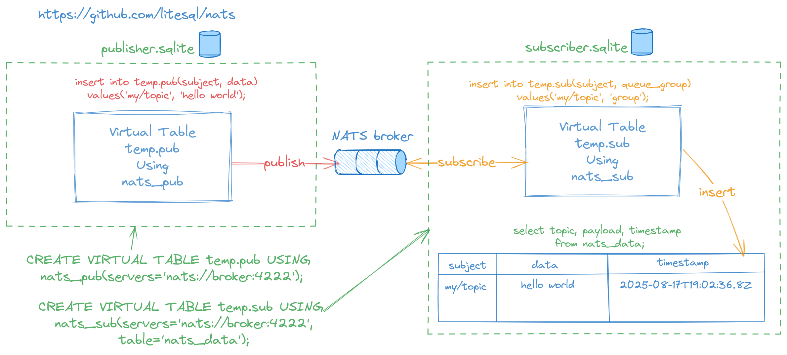

# sqlite-nats
SQLite Extension to integrate with NATS and JetStream servers.



## Installation

Download **nats** extension from the [releases page](https://github.com/litesql/nats/releases).
Here's a great article that explains [how to install the SQLite extension.](https://antonz.org/install-sqlite-extension/)

### Compiling from source

- [Go 1.24+](https://go.dev) and CGO_ENABLED=1 is required.

```sh
go build -ldflags="-s -w" -buildmode=c-shared -o nats.so
```

- Use .so extension for Linux, .dylib for MacOS and .dll for Windows

## Basic usage

### Loading the extension

```sh
sqlite3

# Load the extension
.load ./nats

# check version (optional)
SELECT nats_info();
```

### Subscriber

```sh
# Create a virtual table using NATS_SUB to configure the connection to the broker
CREATE VIRTUAL TABLE temp.sub USING NATS_SUB(servers='nats://localhost:4222', table=nats_data);

# Insert the subject name into the created virtual table to subscribe
INSERT INTO temp.sub(subject) VALUES('my/topic');
```

Subscriber table schema:

```sql
TABLE temp.sub(
  subject TEXT,
  queue_group TEXT
)
```

### Publisher

```sh
# Create a virtual table using NATS_PUB to configure the connection to the broker
CREATE VIRTUAL TABLE temp.pub USING NATS_PUB(servers='nats://localhost:4222');

# Insert subject and data into the created virtual table to publish messages
INSERT INTO temp.pub(subject, data) VALUES('my/topic', 'hello');
```

Publisher table schema:

```sql
TABLE temp.pub(
  subject TEXT,
  data BLOB
)
```

### Stored messages

```sh
# Set output mode (optional)
.mode qbox

# Query for the incoming messages
SELECT * FROM nats_data;
┌────────────┬─────────┬───────────────────────────────────────┐
│  subject   │  data   │               timestamp               │
├────────────┼─────────┼───────────────────────────────────────┤
│ 'my/topic' │ 'hello' │ '2025-08-17T16:46:19.565475232-03:00' │
└────────────┴─────────┴───────────────────────────────────────┘
```

Incoming messages are stored in tables according to the following schema:

```sql
TABLE nats_data(
  subject TEXT,
  data BLOB,
  timestamp DATETIME
)
```

### Subscriptions management

Query the subscription virtual table (the virtual table created using **nats_sub**) to view all the active subscriptions for the current SQLite connection.

```sql
SELECT * FROM temp.sub;
┌────────────┬─────────────┐
│  subject   │ queue_group │
├────────────┼─────────────┤
│ 'my/topic' │ NULL        │
└────────────┴─────────────┘
```

Delete the row to unsubscribe from the topic:

```sql
DELETE FROM temp.sub WHERE subject = 'my/topic';
```

## Configuring

You can configure the connection to the broker by passing parameters to the VIRTUAL TABLE.

| Param | Description | Default |
|-------|-------------|---------|
| client_name | Client name used to connect to the server | |
| servers | Comma-separated list of URLs to connect to the broker. Ex: nats://localhost:4222 | |
| username | Username to connect to broker | |
| password | Password to connect to broker | |
| token | Token to connect to broker | |
| timeout | Timeout in milliseconds | 2000 |
| insecure | Insecure skip TLS validation | false |
| cert_file | TLS: Path to certificate file | |
| cert_key_file | TLS: Path to certificate key file | |
| ca_file | TLS: Path to CA certificate file | |
| table | Name of the table where incoming messages will be stored. Only for nats_sub and jetstream_sub | nats_data and jetstream_data |
| logger | Log errors to stdout, stderr or file:/path/to/file.log |

## Using JetStream

### Subscriber

```sh
# Create a virtual table using JETSTREAM_SUB to configure the connection to the broker
CREATE VIRTUAL TABLE temp.sub USING JETSTREAM_SUB(servers='nats://localhost:4222', table=jetstream_data, timeout=5000);

# Insert the stream name into the created virtual table to subscribe
INSERT INTO temp.sub(stream, subject) VALUES('my_stream', 'my_topic');
```

Subscriber table schema:

```sql
TABLE temp.sub(
  stream TEXT,
  subject TEXT,
  durable TEXT
)
```

### Publisher

```sh
# Create a virtual table using JETSTREAM_PUB to configure the connection to the broker
CREATE VIRTUAL TABLE temp.pub USING JETSTREAM_PUB(servers='nats://localhost:4222', timeout=5000);

# Insert subject and data into the created virtual table to publish messages
INSERT INTO temp.pub(subject, data) VALUES('my_topic', 'hello');
```

Publisher table schema:

```sql
TABLE temp.pub(
  subject TEXT,
  data BLOB
)
```

### Stored messages

```sh
# Set output mode (optional)
.mode qbox

# Query for the incoming messages
SELECT subject, data, timestamp FROM jetstream_data;
┌──────────────┬─────────┬───────────────────────────────────────┐
│  subject     │  data   │               timestamp               │
├──────────────┼─────────┼───────────────────────────────────────┤
│ 'my_subject' │ 'hello' │ '2025-08-18T22:32:59.121518731-03:00' │
└──────────────┴─────────┴───────────────────────────────────────┘
```

Incoming messages are stored in tables according to the following schema:

```sql
TABLE jetstream_data(
  subject TEXT,
  data BLOB,
  headers JSONB,
  reply TEXT,
  timestamp DATETIME
)
```

